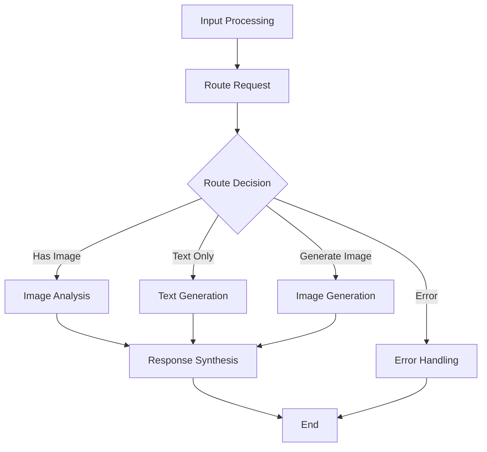

# LangGraph Multimodal Chatbot Backend

A comprehensive Python backend for a multimodal chatbot powered by LangGraph, LangChain, and AWS Bedrock. This system supports text and image processing using Claude (Anthropic) for language understanding and Titan Image/Stability AI for image generation.

## 🚀 Features

### Core Capabilities
- **Multimodal Processing**: Handle text and image inputs simultaneously
- **LangGraph Workflows**: Conditional logic and agent-based processing
- **AWS Bedrock Integration**: Claude, Titan Image, and Stability AI models
- **Image Upload Support**: S3 presigned URLs and direct upload
- **RESTful API**: FastAPI-based endpoints with automatic documentation
- **Production Ready**: Docker, logging, monitoring, and AWS deployment

### Supported Models
- **Claude 3 Sonnet**: Advanced language understanding and multimodal analysis
- **Titan Image Generator**: High-quality image generation
- **Stability AI**: Advanced image generation with style controls

## 📁 Project Structure

```
backend/
├── main.py                 # FastAPI application entry point
├── agents/                 # LangChain tools and agents
├── graphs/                 # LangGraph workflow definitions
│   └── multimodal_graph.py
├── chains/                 # Reusable LangChain chains
│   └── multimodal_chain.py
├── services/               # AWS Bedrock, S3, and other services
│   ├── bedrock_service.py
│   └── s3_service.py
├── routers/                # FastAPI route handlers
│   └── chat.py
├── schemas/                # Pydantic models
│   └── chat.py
├── config/                 # Configuration and settings
│   └── settings.py
├── utils/                  # Helper functions
│   └── image_utils.py
├── infrastructure/         # AWS deployment resources
│   ├── terraform/
│   ├── iam-policy.json
│   └── iam-trust-policy.json
├── requirements.txt        # Main dependencies
├── requirements-minimal.txt # Fallback minimal dependencies
├── fix_installation.py     # Automated dependency fix script
├── test_installation.py    # Installation verification script
├── env.template           # Environment configuration template
├── Dockerfile
├── docker-compose.yml
├── Makefile
├── INSTALL.md             # Detailed installation guide
├── QUICK_FIX.md          # Quick troubleshooting guide
└── QUICKSTART.md         # 5-minute setup guide
```

## 🛠️ Installation & Setup

### Prerequisites

- Python 3.11+ (tested with 3.11.11)
- AWS Account with Bedrock access
- Docker (optional)
- AWS CLI configured

### 🎯 Quick Start (5 minutes)

```bash
# 1. Navigate to backend directory
cd backend

# 2. Activate your Python environment
# Option A: Conda
conda activate your-env

# Option B: Virtual environment
python -m venv venv
source venv/bin/activate  # On Windows: venv\Scripts\activate

# 3. Run automated installation fix
python fix_installation.py

# 4. Configure environment
cp env.template .env
# Edit .env with your AWS credentials (see configuration section)

# 5. Start the server
python main.py
```

🎉 **Your server is now running at http://localhost:8000**

### 📚 Having Issues? We've Got You Covered

- **Quick fixes**: Check [QUICK_FIX.md](backend/QUICK_FIX.md)
- **Detailed troubleshooting**: See [INSTALL.md](backend/INSTALL.md)  
- **5-minute setup**: Follow [QUICKSTART.md](backend/QUICKSTART.md)

### 🔧 Installation Methods

#### Method 1: Automated Fix (Recommended)
```bash
python fix_installation.py
```
This script automatically:
- Detects your Python environment
- Upgrades pip
- Removes conflicting packages
- Tries multiple installation approaches
- Verifies everything works

#### Method 2: Makefile Commands
```bash
# Standard installation
make install

# Minimal installation (fallback)
make install-minimal

# Safe installation (with conflict resolution)
make install-safe

# Fix existing installation
make fix-install

# Test installation
make test-install
```

#### Method 3: Manual Installation
```bash
# Using pip
pip install -r requirements.txt

# If that fails, try minimal requirements
pip install -r requirements-minimal.txt

# Verify installation
python test_installation.py
```

#### Method 4: Docker (If all else fails)
```bash
make docker-build
make docker-run
```

### 🔧 Common Installation Issues & Solutions

#### Issue 1: LangChain Version Conflicts
```bash
# Error: langchain==0.1.0 requires langchain-core>=0.1.7
# Solution: Our fix script handles this automatically
python fix_installation.py
```

#### Issue 2: Pydantic Warnings
```bash
# Error: Field "model_used" has conflict with protected namespace "model_"
# Solution: Already fixed in schemas/chat.py with model_config
```

#### Issue 3: Claude Model Compatibility
```bash
# Error: Claude v3 models are not supported by BedrockLLM
# Solution: Already fixed - we use ChatBedrock instead
```

#### Issue 4: Chain Initialization Errors
```bash
# Error: "MultimodalAnalysisChain" object has no field "llm"
# Solution: Already fixed with lazy loading approach
```

## ⚙️ Configuration

### 1. Environment Variables

Copy and edit the environment template:

```bash
cp env.template .env
```

**Required environment variables:**
```env
# AWS Configuration
AWS_REGION=us-east-1
AWS_ACCESS_KEY_ID=your-access-key-id
AWS_SECRET_ACCESS_KEY=your-secret-access-key
AWS_SESSION_TOKEN=your-session-token  # Optional

# S3 Configuration
S3_BUCKET_NAME=your-multimodal-chatbot-bucket
S3_PRESIGNED_URL_EXPIRY=3600

# Bedrock Configuration
BEDROCK_REGION=us-east-1
BEDROCK_CLAUDE_MODEL=anthropic.claude-3-sonnet-20240229-v1:0
BEDROCK_TITAN_IMAGE_MODEL=amazon.titan-image-generator-v1
BEDROCK_STABILITY_MODEL=stability.stable-diffusion-xl-base-v1-0

# API Configuration
DEBUG=true
HOST=0.0.0.0
PORT=8000
```

### 2. AWS Setup

#### Create S3 Bucket
```bash
aws s3 mb s3://your-multimodal-chatbot-bucket
aws s3api put-bucket-cors --bucket your-multimodal-chatbot-bucket --cors-configuration file://cors.json
```

#### Set up IAM Permissions
Use the provided IAM policy files:
- `infrastructure/iam-policy.json`
- `infrastructure/iam-trust-policy.json`

## 🚀 Running the Application

### Development Mode

```bash
# Start development server
python main.py

# Or using Makefile
make dev

# Or using uvicorn directly
uvicorn main:app --reload --host 0.0.0.0 --port 8000
```

### Background Mode

```bash
# Start in background
nohup python main.py > server.log 2>&1 &

# Check if running
curl http://localhost:8000/health
```

### Using Docker

```bash
# Build and run
make docker-build
make docker-run

# Or using docker-compose
docker-compose up -d
```

## 📚 API Documentation & Testing

### Interactive Documentation

Once running, access the interactive API documentation:

- **Swagger UI**: http://localhost:8000/docs
- **ReDoc**: http://localhost:8000/redoc
- **OpenAPI JSON**: http://localhost:8000/openapi.json

### 🧪 Test Your Installation

#### 1. Health Check
```bash
curl http://localhost:8000/health
# Expected: {"status":"healthy","service":"langgraph-chatbot"}
```

#### 2. Test Text Chat
```bash
curl -X POST "http://localhost:8000/api/v1/chat/text?question=Hello%20how%20are%20you&session_id=test-session"
```

#### 3. Test Multimodal Chat
```bash
curl -X POST "http://localhost:8000/api/v1/chat/multimodal" \
  -H "Content-Type: application/json" \
  -d '{
    "question": "What is this?",
    "image_url": "https://example.com/image.jpg",
    "message_type": "multimodal",
    "session_id": "test-session"
  }'
```

### 🔗 Available Endpoints

| Endpoint | Method | Description |
|----------|---------|-------------|
| `/health` | GET | Basic health check |
| `/api/v1/chat/health` | GET | Chat service health check |
| `/api/v1/chat/text` | POST | Text-only chat |
| `/api/v1/chat/multimodal` | POST | Multimodal chat (text + image) |
| `/api/v1/chat/analyze-image` | POST | Image analysis only |
| `/api/v1/chat/generate-image` | POST | Image generation |
| `/api/v1/chat/upload-image` | POST | Get presigned URL for upload |
| `/api/v1/chat/upload-image-direct` | POST | Direct image upload |
| `/api/v1/chat/session/{session_id}/history` | GET | Get conversation history |
| `/api/v1/chat/session/{session_id}` | DELETE | Clear conversation |
| `/api/v1/chat/models` | GET | List available models |

## 🏗️ Architecture Overview

### LangGraph Workflow

The system uses LangGraph for sophisticated workflow management:



### Key Components

1. **Chain Classes**: Reusable LangChain chains for different tasks
2. **Lazy Loading**: Chains are created only when needed to avoid initialization issues
3. **State Management**: LangGraph state tracks conversation context
4. **Conditional Logic**: Routes based on input type and content
5. **Error Handling**: Graceful error recovery and logging

### Fixed Issues

- ✅ **Pydantic Warnings**: Fixed with `model_config = {"protected_namespaces": ()}`
- ✅ **LangChain Compatibility**: Using `ChatBedrock` instead of deprecated `BedrockLLM`
- ✅ **Chain Initialization**: Implemented lazy loading to avoid field errors
- ✅ **Dependency Conflicts**: Created automated fix script for common issues

## 🔐 Security & Best Practices

### AWS Security

```json
{
  "Version": "2012-10-17",
  "Statement": [
    {
      "Effect": "Allow",
      "Action": [
        "bedrock:InvokeModel",
        "bedrock:InvokeModelWithResponseStream"
      ],
      "Resource": "arn:aws:bedrock:*:*:model/*"
    },
    {
      "Effect": "Allow",
      "Action": [
        "s3:GetObject",
        "s3:PutObject",
        "s3:DeleteObject"
      ],
      "Resource": "arn:aws:s3:::your-bucket/*"
    }
  ]
}
```

### Security Checklist

- [ ] Use IAM roles instead of access keys
- [ ] Enable S3 bucket encryption
- [ ] Set up VPC for production
- [ ] Use HTTPS in production
- [ ] Enable CloudWatch monitoring
- [ ] Set up proper CORS policies

## 🧪 Development & Testing

### Code Quality

```bash
# Format code
make format

# Run linting
make lint

# Type checking
make type-check

# Run tests
make test

# Test installation
make test-install
```

### Adding New Features

1. **New Endpoints**: Add to `routers/chat.py`
2. **New Models**: Update `services/bedrock_service.py`
3. **New Workflows**: Extend `graphs/multimodal_graph.py`
4. **New Chains**: Add to `chains/multimodal_chain.py`

### Debugging

```bash
# Check server logs
tail -f server.log

# Debug with verbose logging
export LOG_LEVEL=DEBUG
python main.py

# Test specific components
python test_installation.py
```

## 📈 Production Deployment

### Environment Setup

```bash
# Production environment
export DEBUG=false
export LOG_LEVEL=INFO
export HOST=0.0.0.0
export PORT=8000
```

### Deployment Options

1. **AWS Lambda**: Serverless deployment
2. **AWS ECS**: Container orchestration
3. **AWS EC2**: Traditional deployment
4. **Docker**: Containerized deployment

### Monitoring

```bash
# Health checks
curl http://localhost:8000/health
curl http://localhost:8000/api/v1/chat/health

# Metrics endpoint (if enabled)
curl http://localhost:8000/metrics
```

## 🚨 Troubleshooting Guide

### Common Issues

#### Server Won't Start
```bash
# Check Python version
python --version  # Should be 3.11+

# Check dependencies
python test_installation.py

# Check environment variables
cat .env

# Check logs
tail -f server.log
```

#### API Returns Empty Responses
```bash
# Check AWS credentials
aws bedrock list-foundation-models --region us-east-1

# Check S3 bucket
aws s3 ls s3://your-bucket-name

# Check environment variables
echo $AWS_ACCESS_KEY_ID
```

#### Dependency Conflicts
```bash
# Run the fix script
python fix_installation.py

# Or try manual fix
pip uninstall langchain langchain-core langchain-aws -y
pip install -r requirements.txt
```

### Getting Help

1. **Check logs**: `tail -f server.log`
2. **Run diagnostics**: `python test_installation.py`
3. **Check API docs**: http://localhost:8000/docs
4. **Review configuration**: Ensure `.env` is properly set

## 📝 Example Usage

### Python Client
```python
import requests

# Health check
response = requests.get("http://localhost:8000/health")
print(response.json())

# Text chat
response = requests.post(
    "http://localhost:8000/api/v1/chat/text",
    params={"question": "Hello, how are you?", "session_id": "test"}
)
print(response.json())

# Multimodal chat
response = requests.post(
    "http://localhost:8000/api/v1/chat/multimodal",
    json={
        "question": "What's in this image?",
        "image_url": "https://example.com/image.jpg",
        "message_type": "multimodal",
        "session_id": "test"
    }
)
print(response.json())
```

### cURL Examples
```bash
# Test all endpoints
curl http://localhost:8000/health
curl -X POST "http://localhost:8000/api/v1/chat/text?question=Hello&session_id=test"
curl -X POST "http://localhost:8000/api/v1/chat/multimodal" \
  -H "Content-Type: application/json" \
  -d '{"question": "Hello", "session_id": "test"}'
```

## 🎯 Next Steps

1. **Configure AWS**: Set up your AWS credentials and S3 bucket
2. **Test API**: Use the interactive docs at http://localhost:8000/docs
3. **Deploy**: Choose your deployment method (Docker, AWS, etc.)
4. **Monitor**: Set up logging and health checks
5. **Scale**: Configure auto-scaling and load balancing

## 📄 License

This project is licensed under the MIT License - see the LICENSE file for details.

## 🤝 Contributing

1. Fork the repository
2. Create a feature branch
3. Run tests: `make test`
4. Submit a pull request

## 📞 Support

For issues and questions:
- Check the [INSTALL.md](backend/INSTALL.md) guide
- Review the [QUICK_FIX.md](backend/QUICK_FIX.md) solutions
- Use the interactive API docs at `/docs`
- Create an issue on GitHub

## 🔄 Changelog

### Version 1.0.0 (Current)
- ✅ Initial release with multimodal chat support
- ✅ LangGraph workflow integration
- ✅ AWS Bedrock integration (Claude, Titan, Stability AI)
- ✅ Fixed Pydantic v2 compatibility issues
- ✅ Fixed LangChain Claude model compatibility
- ✅ Implemented lazy loading for chain initialization
- ✅ Added automated dependency resolution
- ✅ Comprehensive installation guides and troubleshooting
- ✅ Production-ready Docker deployment
- ✅ Complete API documentation and testing guides